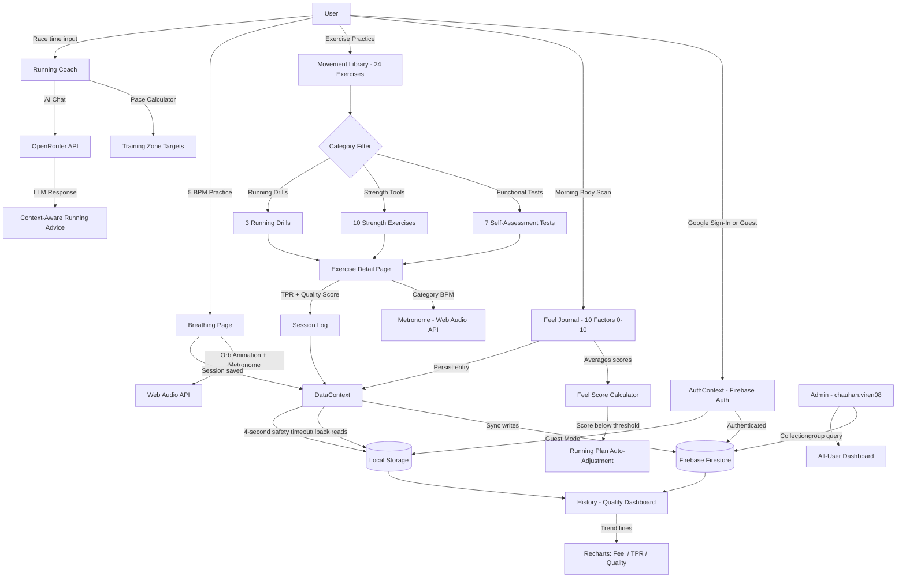

# The Gentle BadAss Movement — Mindfulness Framework

**SCAD AI 201 — Project 3: Persons Required**
**Designer:** Viren Chauhan | **Person:** Dr. Rajat Chauhan
**Live App:** [your-deployed-url-here]

---

## Design Argument

Dr. Rajat Chauhan is a Sports-Exercise Medicine consultant with 25+ years of clinical practice. He is the author of *The Lazy Runner*, a movement philosopher, and my father. He has spent his career watching runners get injured — not from overtraining, but from under-listening. They train by number: heart rate zones, weekly mileage, pace targets, VO2 max estimates. They have outsourced body awareness to a Garmin watch. When the watch says go, they go. When the watch says stop, they stop. They have lost what Dr. Chauhan calls interoceptive literacy — the ability to feel their own bodies.

What's broken: the fitness technology industry has replaced self-knowledge with dashboards. A runner who cannot feel their own fatigue, joint tenderness, or emotional readiness before a session is not an athlete — they are a data entry point. The injury happens before the run. It happens in the decision to run at all.

What "helped" looks like: a person who wakes up, does a 2-minute body scan, scores how they actually feel across ten dimensions, and makes a training decision based on that — not on what the plan says. A person who knows the difference between the soreness that means "push through" and the tightness that means "back off." A person who can run for thirty more years.

Why I am the one building this: I have direct access to 25 years of clinical philosophy that has never been digitized. My father does not want an app — he wants his methodology in a form that other people can use. He is the subject matter expert. I am the translator. That is my unfair advantage: proximity to the source, and a reason to get it right.

This argument was written before any AI engagement. Every decision in this product is evaluated against it.

---

## Research Documentation

**Subject:** Dr. Rajat Chauhan, Sports-Exercise Medicine Consultant, Author, Runner
**Relationship:** Father / Clinical Expert
**Research Method:** In-person conversation, review of published philosophy, observation of his consultation practice

**Core Observed Pain Points:**

1. Runners show up to training without assessing readiness. They follow a plan even when their body is signaling rest. Dr. Chauhan calls this "plan obedience over body intelligence."

2. Wearables create false confidence. A runner with a resting heart rate of 62 BPM feels validated — even if their sleep was broken, their joints are stiff, and they are emotionally depleted. The number overrides the feeling.

3. There is no tool that teaches a person *how to feel*. Apps tell you what to do, not how to listen. The act of self-assessment is itself missing from fitness culture.

4. His clinical framework — I, My, Me — is taught verbally in consultations but has no portable, daily-use format. Patients leave sessions with knowledge they cannot sustain between appointments.

**The I-My-Me Framework (from clinical philosophy):**
- **I** — Identity. Who you are as a mover. Your history, your path, your intention.
- **My** — The body as your engine. Objective: joint fluidity, strength, movement readiness.
- **Me** — The felt experience. Subjective: mood, stress, connection, breath awareness.

**The Three Principles (non-negotiables distilled from clinical practice):**
1. **The Hip Engine** — All power originates at the hips. Knees follow. Feet land.
2. **The Stable Pillar** — The lumbar spine stays quiet while hips and shoulders move. Anti-rotation is the frame.
3. **Core as the Bridge** — The core connects upper and lower body. It resists lateral flexion. It does not crunch.

**[Add here: direct quotes from your interview with Dr. Chauhan — his exact words about what runners get wrong, what he wishes patients could do daily, what he thinks about fitness apps currently. Also add any photos of the consultation environment or movement demonstrations you observed.]**

---

## Platform Rationale

**Platform chosen:** Progressive Web App (React + Vite)

Dr. Chauhan consults patients across multiple countries. His audience is not a demographic — it is anyone who moves: women recovering from injury, older adults rebuilding strength, runners trying to last another decade. That span of person rules out:

- **Native iOS/Android app:** Requires download friction and platform-specific development. His patients are not downloading a new app for a consultation method — they need a URL.
- **Desktop web app:** Dr. Chauhan's methodology is a *morning ritual*. It happens before the run, in the bedroom, at 6am. That is a phone moment, not a laptop moment.
- **A PDF or print format:** It cannot adapt to the user's history, cannot track feel scores over time, cannot adjust the running plan dynamically.

A Progressive Web App solves all three. It works on any device with a browser. It installs to the home screen with one tap. It runs offline (localStorage fallback) when connectivity is intermittent — which matters for trail runners and travel. It does not require app store approval or a development account.

React was chosen for component reusability (the same slider component powers 10 journal factors; the same metronome runs across three exercise categories) and because the Vite build pipeline keeps the app fast at the speed that a morning-ritual tool demands. No heavy UI framework — every visual decision was made from scratch to match the product's visual philosophy: no burn rings, no gamification, no red alerts.

---

## Shipped Product

**Live URL:** [your-deployed-url-here]
**Stack:** Vite + React 18, React Router 6, Firebase Auth + Firestore, Recharts, Web Audio API, vite-plugin-pwa

The app has seven functional sections:

**Feel (Daily Journal)** — Ten factors rated 0–10 with sliders, organized into Body, Mind, and Movement categories. Produces a daily Feel Score (average). If the score falls below a threshold, the running plan automatically adjusts for that day. Optional per-factor notes and a daily reflection field.

**Breathe** — 5 BPM breathing practice (configurable inhale/exhale seconds). An animated orb scales to breath phase. A real-second metronome marks the rhythm. Sessions are logged to the journal.

**Move (Library)** — 24 exercises across three categories: Functional Tests (weekly baseline self-assessments), Strength Tools (10-second cadence, lumbar-neutral), and Running Drills (hip-driven, soft landing). Each exercise includes purpose, verbal cue, step-by-step breakdown, category-matched metronome, and an anti-rotation warning.

**History (Quality Dashboard)** — Recharts trend lines for Feel Score, Training Perceived Readiness, and Quality Score over time. Factor breakdown showing strongest and weakest dimensions. Session log.

**Running Coach** — Benchmark race-to-pace calculator (input a race time, get training zones). Weekly plan builder. Context-aware AI coaching via OpenRouter. Daily check-ins.

**Onboarding** — Three steps: fitness history, path selection (Rehab / Beginner / Performance), commitment duration (30–270 days). Saves to Firestore.

**Auth:** Google Sign-in (Firebase) or Guest mode. Journal, Library, and History are locked behind auth. The app works fully offline with localStorage fallback; data syncs to Firestore when online.

---

## User Testing Evidence

**First Contact:** Session 16 — [Date: May 13, 2026]
**Format:** [In-person / screen share — fill in]
**Duration:** [fill in]

**What I observed:**

[Document what Dr. Chauhan did when you put the prototype in front of him for the first time. What did he navigate to first? What did he reach for that wasn't there? What did he ignore? What did he say? What did he do without being told?]

**Specific moments:**

- [Moment 1: what happened, what it revealed]
- [Moment 2: what happened, what it revealed]
- [Moment 3: what happened, what it revealed]

**What surprised me:**

[What did you expect him to do that he didn't? What did he do that you didn't expect?]

**What I changed after testing:**

[List any changes to the app made as a result of what you observed]

**Evidence:** [Link to screen recording / photos / session notes]

---

## Mermaid Diagram



---

## AI Direction Log

**Entry 1**
*What I asked:* Build the core journal page — 10 sliders, 0-10 scale, organized into Body/Mind/Movement categories with an average Feel Score.
*What it produced:* A functional slider layout with a basic average calculation.
*What I changed:* The visual grouping was too clinical — three hard columns like a spreadsheet. I directed it to use subtle color-coding per category (sage for Body, warm brown for Mind, blue for Movement) and softer section labels, so the categories feel like moods rather than data types.
*Why:* The design argument says this is a body scan, not a form. The UI had to feel like listening, not filing.

**Entry 2**
*What I asked:* Build an exercise library with Functional Tests, Strength Tools, and Running Drills as filter categories.
*What it produced:* A basic list with filter buttons.
*What I changed:* I directed it to add the "5 Pillars" pre-flight banner (Smile, Tall Puppet, Relaxed Fists, Uncurl Toes, Breathe) at the top of every exercise session, and the anti-rotation warning on each exercise card. These came from Dr. Chauhan's clinical language — AI had no way to know this. I provided the exact copy.
*Why:* The library was architecturally correct but philosophically empty. The pillars are the whole point.

**Entry 3**
*What I asked:* Implement a metronome that plays at different BPMs for different exercise categories — 60 for strength, and 160-190 for running drills.
*What it produced:* A metronome using setInterval with a click sound.
*What I changed:* I directed it to rebuild it using Web Audio API synthesis instead, and to add a visual beat indicator. The setInterval approach drifted — by rep 8 the timing was off enough to matter.
*Why:* The 10-second cadence (5 sec up / 5 sec down) is a clinical non-negotiable from the design argument. Drift is not acceptable.

**Entry 4**
*What I asked:* Build a running coach page with a race-to-training-pace calculator and a weekly plan template.
*What it produced:* A pace calculator that converted a race time to a single pace target.
*What I changed:* I directed it to output the full set of training zones — easy, moderate, hard, long run — with time-per-mile targets for each, based on standard running physiology ratios from Dr. Chauhan's methodology.
*Why:* One pace is useless. Runners need zones because easy runs are not the same as threshold runs.

**Entry 5**
*What I asked:* Add Firebase Firestore sync to the DataContext so that journal entries persist across devices.
*What it produced:* Basic Firestore read/write calls.
*What I changed:* I directed it to add a 4-second safety timeout that falls back to localStorage if Firestore doesn't respond, and to always write to localStorage simultaneously as a cache. I also directed it to migrate guest data into Firestore on first sign-in.
*Why:* Dr. Chauhan travels. He might journal on airplane wifi. The app cannot simply fail — the morning ritual cannot break because of a network timeout.

**[Add additional entries for 5+ total — include any moments where you directed the visual design, rejected copy AI generated, changed component structure, or overrode a technical approach.]**

---

## Records of Resistance

**Resistance 1 — Rejected the gamification instinct**
AI produced a home screen with a streak counter displayed prominently as a large number with a flame emoji and color animation. It looked like a fitness app. It looked like every fitness app.
*Why I rejected it:* The design argument explicitly says no burn rings, no gamification, no red alerts. A streak displayed as an achievement creates anxiety about breaking it. Dr. Chauhan's methodology is about sustainable self-awareness, not performance theater.
*What I did instead:* I kept the streak as a quiet stat in a subdued row of three numbers (days logged, streak, days remaining). Small text. No animation. No emoji. It is there for context, not for motivation.

**Resistance 2 — Rejected AI-generated exercise copy**
When asked to write exercise descriptions and cues, AI produced technically accurate but generic instructions. The squat cue was: "Keep your chest up and knees tracking over your toes."
*Why I rejected it:* Dr. Chauhan's clinical language is specific and embodied. His cue for the squat is: "Sit back like there's a chair behind you — feel the floor through your whole foot." That specificity is the product. Generic biomechanics copy could come from any fitness website.
*What I did instead:* I wrote all exercise cues and anti-rotation notes from Dr. Chauhan's clinical vocabulary directly. AI built the structure; I wrote the content.

**Resistance 3 — Rejected the suggested color palette**
AI suggested a high-contrast palette with a green primary, white background, and dark gray text — clean, accessible, modern.
*Why I rejected it:* The design argument calls for visual calm. High-contrast green reads as urgency and performance. It belongs on a running shoe brand, not a morning body scan.
*What I did instead:* I specified the exact palette: cream (#f5f0e8) background, ink text, sage/warm brown/cool blue as category accents. The colors are muted and warm. They read as 7am, not as competition.

**[Add additional resistance records to meet the 3+ requirement and include any others you encountered during the build.]**

---

## Five Questions Reflection

*[Complete before submission. These questions are provided by SCAD AI 201 — answer them here in relation to Dr. Rajat Chauhan specifically.]*

**Q1:** [Question text — answer here]

**Q2:** [Question text — answer here]

**Q3:** [Question text — answer here]

**Q4:** [Question text — answer here]

**Q5:** [Question text — answer here]

---

## Post-Mortem

*[Written after the full Design Cycle is complete.]*

**What worked:**

[What decisions proved correct? What parts of the product delivered on the design argument? What surprised you in a good way?]

**What failed:**

[What did you get wrong? What did you have to rebuild? What did user testing reveal that you missed?]

**What I would do differently:**

[With hindsight, what would you change about your process — not the product?]

**What I learned about designing for a real person:**

[How was this different from designing for a hypothetical user? What changed when the person had a face, a name, and an opinion?]

---

## Case Study Presentation

**Session 20 — May 27, 2026**

This is not a demo. It is a defense of a design argument.

The presentation covers:

1. **The Person** — Who is Dr. Rajat Chauhan? Why does his problem matter?
2. **The Problem** — What is interoceptive illiteracy? How did it get this bad? What does the data say?
3. **The Research** — What did I learn that I didn't know before the interviews?
4. **The Prototype Failures** — What didn't work and why? What did First Contact reveal?
5. **The Iteration** — What changed, what was rebuilt, what was cut?
6. **The Evidence** — What does it look like when Dr. Chauhan uses this tool?
7. **The Product** — Live demonstration of the shipped PWA.
8. **The Argument** — Does this tool do what the design argument said it would?

[Slide deck / presentation materials: link here when ready]

---

## Marketing Minute

**60-Second Commercial — The Gentle BadAss Movement Framework**

*Formatted for YouTube (16:9) and Instagram Reels (9:16 vertical)*

**Concept:** We open on a runner staring at their watch. Cut to a runner sitting quietly with their eyes closed. One knows their pace. One knows their body.

**Script (60 seconds):**

> [0-5s] You track everything.
> [5-10s] Your pace. Your heart rate. Your sleep score.
> [10-15s] And you still get injured.
> [15-20s] Because no wearable can tell you how you feel.
> [20-30s] The Gentle BadAss Movement Framework is a daily tool built on 25 years of Sports-Exercise Medicine.
> [30-40s] Every morning: ten questions. Two minutes. One number that tells you how ready your body actually is.
> [40-50s] It adjusts your training plan. It teaches you to move with form. It brings you back to your body.
> [50-55s] Not a fitness app. A practice.
> [55-60s] gentlebadass.com — Start listening.

**Production notes:**
- YouTube cut: 16:9 landscape, titles centered, voiceover + ambient sound (morning birds, footsteps on a path)
- Instagram Reels cut: 9:16 vertical, bold text overlays on each beat, same audio
- Tone: quiet, unhurried, confident — matches the app's visual language

[Final video: link here when produced]

---

## Getting Started

```bash
npm install
npm run dev
```

**Environment variables required** (see `.env.example`):
- `VITE_FIREBASE_API_KEY` and related Firebase config
- `VITE_OPENROUTER_API_KEY` for AI running coach
