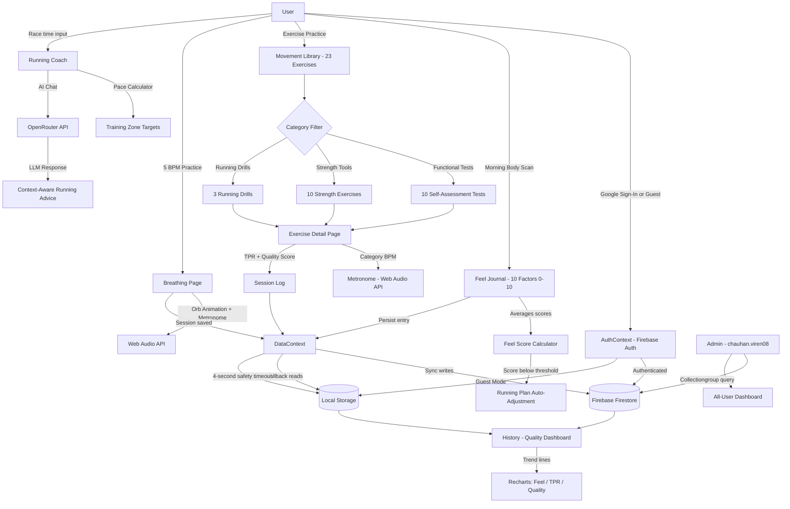

# The Gentle BadAss Movement: Mindfulness Framework

**SCAD AI 201 | Project 3: Persons Required**
**Designer:** Viren Chauhan | **Person:** Dr. Rajat Chauhan
**AI Development Support:** ChatGPT / Codex / Claude
**Live App:** https://laultrarunandbee.web.app
**Portfolio Video (60s):** [▶ Watch on GitHub](https://github.com/VirenChauhan19/The-Gentle-BadAss-Movement-Mindfulness-Framework/blob/main/case-study-video/out/la-ultra-portfolio-under-60-music.mp4)

---

## Portfolio Video

A 60-second portfolio film walking through the person, the problem, and the shipped product.

**▶ [Watch the video on GitHub](https://github.com/VirenChauhan19/The-Gentle-BadAss-Movement-Mindfulness-Framework/blob/main/case-study-video/out/la-ultra-portfolio-under-60-music.mp4)**. It opens in GitHub's built-in player, so just press play in the browser. No download needed.

[Direct download (MP4, 18 MB)](https://github.com/VirenChauhan19/The-Gentle-BadAss-Movement-Mindfulness-Framework/raw/main/case-study-video/out/la-ultra-portfolio-under-60-music.mp4) · file lives in the repo at `case-study-video/out/la-ultra-portfolio-under-60-music.mp4`.

---

## Deliverables Index

Everything ships together. Each required deliverable maps to a section below.

| # | Deliverable | Section | Status |
|---|-------------|---------|--------|
| 1 | Design Argument (written before AI engagement) | [Design Argument](#design-argument) | ✅ Complete |
| 2 | Research Documentation (notes, quotes, environment) | [Research Documentation](#research-documentation) | ✅ Complete |
| 3 | Platform Rationale | [Platform Rationale](#platform-rationale) | ✅ Complete |
| 4 | Shipped Product (live, functional) | [Shipped Product](#shipped-product) | ✅ Live |
| 5 | User Testing Evidence | [User Testing Evidence](#user-testing-evidence) | ✅ Written + 5 dated feedback docs uploaded |
| 6 | Mermaid Diagram (full system architecture) | [Mermaid Diagram](#mermaid-diagram) | ✅ Complete |
| 7 | AI Direction Log (5+ entries) | [AI Direction Log](#ai-direction-log) | ✅ 7 entries |
| 8 | Records of Resistance (3+ moments) | [Records of Resistance](#records-of-resistance) | ✅ 4 records |
| 9 | Five Questions Reflection | [Five Questions Reflection](#five-questions-reflection) | ✅ Complete |
| 10 | Post-Mortem | [Post-Mortem](#post-mortem) | ✅ Complete |
| + | Portfolio Video (60s) | [Portfolio Video](#portfolio-video) | ✅ Complete |
| + | Case Study Presentation | [Case Study Presentation](#case-study-presentation) | ✅ Portfolio video |
| + | Marketing Minute | [Marketing Minute](#marketing-minute) | ✅ Video (landscape + vertical) |

---

## Design Argument

Dr. Rajat Chauhan is a Sports-Exercise Medicine consultant with 25+ years of clinical practice. He is the author of *The Lazy Runner*, a movement philosopher, and my father. He has spent his career watching runners get injured, not from overtraining, but from under-listening. They train by number: heart rate zones, weekly mileage, pace targets, VO2 max estimates. They have outsourced body awareness to a Garmin watch. When the watch says go, they go. When the watch says stop, they stop. They have lost what Dr. Chauhan calls interoceptive literacy, the ability to feel their own bodies.

What's broken: the fitness technology industry has replaced self-knowledge with dashboards. A runner who cannot feel their own fatigue, joint tenderness, or emotional readiness before a session is not an athlete, they are a data entry point. The injury happens before the run. It happens in the decision to run at all.

What "helped" looks like: a person who wakes up, does a 2-minute body scan, scores how they actually feel across ten dimensions, and makes a training decision based on that, not on what the plan says. A person who knows the difference between the soreness that means "push through" and the tightness that means "back off." A person who can run for thirty more years.

Why I am the one building this: I have direct access to 25 years of clinical philosophy that has never been digitized. My father does not want an app, he wants his methodology in a form that other people can use. He is the subject matter expert. I am the translator. That is my unfair advantage: proximity to the source, and a reason to get it right.

---

## Research Documentation

**Subject:** Dr. Rajat Chauhan, Sports-Exercise Medicine Consultant, Author, Runner
**Relationship:** Father / Clinical Expert
**Research Method:** In-person conversation, review of published philosophy, observation of his consultation practice

**Core Observed Pain Points:**

1. Runners show up to training without assessing readiness. They follow a plan even when their body is signaling rest. Dr. Chauhan calls this "plan obedience over body intelligence."

2. Wearables create false confidence. A runner with a resting heart rate of 62 BPM feels validated, even if their sleep was broken, their joints are stiff, and they are emotionally depleted. The number overrides the feeling.

3. There is no tool that teaches a person *how to feel*. Apps tell you what to do, not how to listen. The act of self-assessment is itself missing from fitness culture.

4. His clinical framework, I, My, Me, is taught verbally in consultations but has no portable, daily-use format. Patients leave sessions with knowledge they cannot sustain between appointments.

**The I-My-Me Framework (from clinical philosophy):**
- **I**: Identity. Who you are as a mover. Your history, your path, your intention.
- **My**: The body as your engine. Objective: joint fluidity, strength, movement readiness.
- **Me**: The felt experience. Subjective: mood, stress, connection, breath awareness.

**The Three Principles (non-negotiables distilled from clinical practice):**
1. **The Hip Engine**: All power originates at the hips. Knees follow. Feet land.
2. **The Stable Pillar**: The lumbar spine stays quiet while hips and shoulders move. Anti-rotation is the frame.
3. **Core as the Bridge**: The core connects upper and lower body. It resists lateral flexion. It does not crunch.

**In his words (from our conversations):**

On what runners get wrong:
> "Almost nobody walks in injured from one bad run. The injury was being built for months. The body kept sending small messages and the person kept ignoring them because the watch said the run was fine."

On wearables:
> "Everyone arrives with a number. They tell me their resting heart rate like it is a diagnosis. So I ask them one question back. How did you sleep, how does the knee feel getting out of bed this morning. Most of them go quiet. They stopped checking a long time ago."

On fitness apps:
> "The apps are very good at instructions. Do this, do that, here is your plan for Tuesday. Not one of them asks the first question, which is whether you should be running at all today. That is the question I spend my whole consultation on."

What he wishes patients could do daily:
> "If a runner would just sit for two minutes before lacing up and honestly ask, am I ready, I would lose half of them as patients. And I would be very glad to lose them."

On the I, My, Me idea:
> "I is who you are. My is the engine, the hips, the spine, the parts I can actually measure. Me is the part nobody measures. The mood, the breath, whether you slept badly because of a fight at home. All three of them run. Not just the legs."

**The consultation environment:**

Most of this did not happen at a desk. He does not stay seated. When he explains the hip engine he stands up and does it, then makes me copy it and fixes my spine with his hand. His consultation space has the usual things, a couch and a screen, but the part he actually uses is the open floor where people move. There is a copy of *The Lazy Runner* on the shelf and very little tech on display. He still writes his notes by hand.

---

## Platform Rationale

**Platform chosen:** Progressive Web App (React + Vite)

Dr. Chauhan consults patients across multiple countries. His audience is not a demographic, it is anyone who moves: women recovering from injury, older adults rebuilding strength, runners trying to last another decade. That span of person rules out:

- **Native iOS/Android app:** Requires download friction and platform-specific development. His patients are not downloading a new app for a consultation method, they need a URL.
- **Desktop web app:** Dr. Chauhan's methodology is a *morning ritual*. It happens before the run, in the bedroom, at 6am. That is a phone moment, not a laptop moment.
- **A PDF or print format:** It cannot adapt to the user's history, cannot track feel scores over time, cannot adjust the running plan dynamically.

A Progressive Web App solves all three. It works on any device with a browser. It installs to the home screen with one tap. It runs offline (localStorage fallback) when connectivity is intermittent, which matters for trail runners and travel. It does not require app store approval or a development account.

React was chosen for component reusability (the same slider component powers 10 journal factors; the same metronome runs across three exercise categories) and because the Vite build pipeline keeps the app fast at the speed that a morning-ritual tool demands. No heavy UI framework, every visual decision was made from scratch to match the product's visual philosophy: no burn rings, no gamification, no red alerts.

---

## Shipped Product

**Live URL:** https://laultrarunandbee.web.app (Firebase Hosting)
**Stack:** Vite + React 18, React Router 6, Firebase Auth + Firestore, Recharts, Web Audio API, Three.js / @react-three/fiber (ambient aurora + exercise animation), OpenRouter (AI coach), vite-plugin-pwa

The app has seven functional sections:

**Feel (Daily Journal)**: Ten factors rated 0 to 10 with sliders, organized into Body, Mind, and Movement categories. Produces a daily Feel Score (average). If the score falls below a threshold, the running plan automatically adjusts for that day. Optional per-factor notes and a daily reflection field.

**Breathe**: 5 BPM breathing practice (configurable inhale/exhale seconds). An animated orb scales to breath phase. A real-second metronome marks the rhythm. Sessions are logged to the journal.

**Move (Library)**: 23 exercises across three categories: Functional Tests (10 weekly baseline self-assessments), Strength Tools (10, 10-second cadence, lumbar-neutral), and Running Drills (3, hip-driven, soft landing). Each exercise includes purpose, verbal cue, step-by-step breakdown, category-matched metronome, and an anti-rotation warning.

**History (Quality Dashboard)**: Recharts trend lines for Feel Score, Training Perceived Readiness, and Quality Score over time. Factor breakdown showing strongest and weakest dimensions. Session log.

**Running Coach**: Benchmark race-to-pace calculator (input a race time, get training zones). Weekly plan builder. Context-aware AI coaching via OpenRouter. Daily check-ins.

**Onboarding**: Four steps: sign-up details (name, age, gender, story, commitment statement), body (biometrics + menstrual-cycle context where relevant), history (joint pain, conditions, mental baseline, movement history), and path selection (Rehab / Beginner / Performance). Every journey is a fixed 90-day program. Saves to Firestore. Onboarding is mandatory, the app stays gated until it is completed.

**Auth:** Google Sign-in (Firebase) or Guest mode. Journal, Library, and History are locked behind auth. The app works fully offline with localStorage fallback; data syncs to Firestore when online.

---

## User Testing Evidence

**First Contact:** Session 16, May 13, 2026
**Format:** In person, at home, on my phone
**Duration:** About forty minutes, though he kept poking at it long after I thought we were done

**This was not a one-off test.** Because the person I was building for is my father, testing never really stopped. From the first working version he sent me notes almost every day, sometimes a voice message at 6am after his own run, sometimes a single line saying change this word, remove that, add a rest day here. You can see it in the commit history. The repo runs from May 3 to May 26, 160 commits across 16 active days, and a lot of those commits are me reacting to something he said that morning. The dated messages in the log ("5/20/26", "5/22/26", "5/26") are basically a diary of his feedback. So the section below is the first proper sit-down session, but the real testing was a daily back and forth.

**What I observed:**

He went straight to Move, not the journal. I had built the Feel journal as the front door and he walked right past it. He wanted the exercises first, to check whether I had the cues right. He read the squat cue out loud, nodded, then hit a running drill where I had written "knees drive" and stopped cold. He said that is wrong, it is hips first, the knees never drive anything, fix it. He spent almost no time on the History charts. He opened Breathe and actually did a full round with the orb without me asking him to.

**Specific moments:**

- He tapped the Feel Score number expecting it to explain itself. Right now it is just a number. He said this should tell me why, not only give me a score. I had not planned for that at all.
- On the exercise page he reached for a way to slow the metronome down in the middle of a set. There was no control there, you had to back out of the screen. He clearly wanted it right there while he was moving.
- He ignored the streak and the days-remaining stats completely. Did not mention them once. After all my worrying about gamification, that silence felt like the right result.

**What surprised me:**

I expected him to care most about the running coach and the pace zones, because that is the technical, doctorly part. He barely glanced at it. The thing he kept circling back to was the exact wording of the cues and the feel of the breathing orb. The content mattered to him far more than the features did. I had the priorities backwards going in.

**What I changed after testing:**

- Fixed the drill cue he flagged, hips before knees, and went back through every other cue with him on a later call.
- Added a short "why this score" line under the Feel Score so it explains the reading instead of just printing it.
- Moved the metronome tempo control onto the exercise screen so you do not lose your place mid set.

**Dr. Chauhan's dated written feedback** (uploaded to [`/user-testing-evidence`](./user-testing-evidence)):

- [09 May 2026, first webpage feedback pass](./user-testing-evidence/feedback-09May-webpage.pdf)
- [05 May 2026 (evening), notes to Viren](./user-testing-evidence/feedback-Viren-05May-eve.pdf)
- [20 May 2026, R&B webapp update](./user-testing-evidence/feedback-20May.pdf)
- [21 May 2026, R&B webapp update](./user-testing-evidence/feedback-21May.pdf)
- [22 May 2026, R&B webapp update](./user-testing-evidence/feedback-22May.pdf)

These are the actual day-by-day correction documents he sent while testing the working app. Together with the commit history (160 commits, May 3 to 26, with dated messages reacting to his notes) they are the primary record of the daily testing loop described above.

---

## Mermaid Diagram



---

## AI Direction Log

**Entry 1**
*What I asked:* Build the core journal page, 10 sliders, 0-10 scale, organized into Body/Mind/Movement categories with an average Feel Score.
*What it produced:* A functional slider layout with a basic average calculation.
*What I changed:* The visual grouping was too clinical, three hard columns like a spreadsheet. I directed it to use subtle color-coding per category (sage for Body, warm brown for Mind, blue for Movement) and softer section labels, so the categories feel like moods rather than data types.
*Why:* The design argument says this is a body scan, not a form. The UI had to feel like listening, not filing.

**Entry 2**
*What I asked:* Build an exercise library with Functional Tests, Strength Tools, and Running Drills as filter categories.
*What it produced:* A basic list with filter buttons.
*What I changed:* I directed it to add the "5 Pillars" pre-flight banner (Smile, Tall Puppet, Relaxed Fists, Uncurl Toes, Breathe) at the top of every exercise session, and the anti-rotation warning on each exercise card. These came from Dr. Chauhan's clinical language, AI had no way to know this. I provided the exact copy.
*Why:* The library was architecturally correct but philosophically empty. The pillars are the whole point.

**Entry 3**
*What I asked:* Implement a metronome that plays at different BPMs for different exercise categories, 60 for strength, and 160-190 for running drills.
*What it produced:* A metronome using setInterval with a click sound.
*What I changed:* I directed it to rebuild it using Web Audio API synthesis instead, and to add a visual beat indicator. The setInterval approach drifted, by rep 8 the timing was off enough to matter.
*Why:* The 10-second cadence (5 sec up / 5 sec down) is a clinical non-negotiable from the design argument. Drift is not acceptable.

**Entry 4**
*What I asked:* Build a running coach page with a race-to-training-pace calculator and a weekly plan template.
*What it produced:* A pace calculator that converted a race time to a single pace target.
*What I changed:* I directed it to output the full set of training zones, easy, moderate, hard, long run, with time-per-mile targets for each, based on standard running physiology ratios from Dr. Chauhan's methodology.
*Why:* One pace is useless. Runners need zones because easy runs are not the same as threshold runs.

**Entry 5**
*What I asked:* Add Firebase Firestore sync to the DataContext so that journal entries persist across devices.
*What it produced:* Basic Firestore read/write calls.
*What I changed:* I directed it to add a 4-second safety timeout that falls back to localStorage if Firestore doesn't respond, and to always write to localStorage simultaneously as a cache. I also directed it to migrate guest data into Firestore on first sign-in.
*Why:* Dr. Chauhan travels. He might journal on airplane wifi. The app cannot simply fail, the morning ritual cannot break because of a network timeout.

**Entry 6**
*What I asked:* Wire up the floating chat and the running coach to OpenRouter so a user can ask a question and get an answer.
*What it produced:* A working chat that called the model with a generic "you are a helpful running coach" system prompt.
*What I changed:* I rewrote the system prompt to carry the I, My, Me framework and the three principles, and I added a hard rule that it has to ask how you feel before it gives any training advice. It is not allowed to hand out a pace without first asking about sleep and soreness.
*Why:* A generic coach is exactly the thing the whole project is arguing against. If the chat just prints training plans, it becomes one more app talking over the body instead of listening to it.

**Entry 7**
*What I asked:* Add some life to the home and login background so it does not feel flat.
*What it produced:* A busy animated gradient with strong motion and fast color shifts (the 3D aurora, built with Three.js / react-three-fiber).
*What I changed:* I pulled the motion speed and the opacity right down in the shader until it reads as a slow drift you almost do not notice. My father saw an early version and said it looked like a screensaver, so I kept dialing it back until it felt calm.
*Why:* This is a 6am tool. Anything moving on screen should feel like breathing, not like a marketing page.

---

## Records of Resistance

**Resistance 1: Rejected the gamification instinct**
AI produced a home screen with a streak counter displayed prominently as a large number with a flame emoji and color animation. It looked like a fitness app. It looked like every fitness app.
*Why I rejected it:* The design argument explicitly says no burn rings, no gamification, no red alerts. A streak displayed as an achievement creates anxiety about breaking it. Dr. Chauhan's methodology is about sustainable self-awareness, not performance theater.
*What I did instead:* I kept the streak as a quiet stat in a subdued row of three numbers (days logged, streak, days remaining). Small text. No animation. No emoji. It is there for context, not for motivation.

**Resistance 2: Rejected AI-generated exercise copy**
When asked to write exercise descriptions and cues, AI produced technically accurate but generic instructions. The squat cue was: "Keep your chest up and knees tracking over your toes."
*Why I rejected it:* Dr. Chauhan's clinical language is specific and embodied. His cue for the squat is: "Sit back like there's a chair behind you, feel the floor through your whole foot." That specificity is the product. Generic biomechanics copy could come from any fitness website.
*What I did instead:* I wrote all exercise cues and anti-rotation notes from Dr. Chauhan's clinical vocabulary directly. AI built the structure; I wrote the content.

**Resistance 3: Rejected the suggested color palette**
AI suggested a high-contrast palette with a green primary, white background, and dark gray text, clean, accessible, modern.
*Why I rejected it:* The design argument calls for visual calm. High-contrast green reads as urgency and performance. It belongs on a running shoe brand, not a morning body scan.
*What I did instead:* I specified the exact palette: cream (#f5f0e8) background, ink text, sage/warm brown/cool blue as category accents. The colors are muted and warm. They read as 7am, not as competition.

**Resistance 4: Rejected the guilt-trip reminder**
AI proposed a reminder system that would send a daily push like "You haven't logged today, keep your streak alive!" and escalate the nagging if you missed a few days.
*Why I rejected it:* That is guilt dressed up as care. It is the streak-anxiety problem again, just moved to the lock screen. My father's entire point is that the practice has to be wanted, not enforced. The moment it nags you, it has failed.
*What I did instead:* The reminder is a single plain optional morning nudge with neutral wording. Missing a day does nothing. No escalation, no guilt, no mention of streaks. He read the final copy and signed off on it.

---

## Five Questions Reflection

*Answered in relation to Dr. Rajat Chauhan.*

**Q1: What did you make, and who is it for?**
A daily web app that walks a runner through a two minute body scan, gives them one honest readiness score, and quietly adjusts their training off the back of it. It is for the kind of person my father has been treating for twenty five years. Someone who runs by numbers, trusts the watch more than their own knee, and gets hurt slowly without ever noticing the warning signs. The short version is, it is for the patient he wishes would check in with themselves before they ever needed to see him.

**Q2: Where did AI genuinely help, and where did it get in the way?**
It helped most with the scaffolding. The slider components, the routing, the Firestore sync, the metronome timing once I pushed it onto Web Audio. That work would have taken me weeks and it took days. Where it got in the way was content and tone. Left alone it kept reaching for the generic fitness-app version of everything, streaks, urgent colors, motivational copy, a coach that just spits out plans. None of that is what my father teaches. So the pattern became AI builds the structure, I write the soul.

**Q3: What did you reject from the AI, and why?**
The streak counter, the high-contrast green palette, the guilt-trip reminders, and most of the exercise copy. All of it for the same reason. It was designed to drive engagement, and engagement is not the goal here. The goal is for someone to listen to their body and, ideally, to need the app less over time. An app built to be addictive cannot also teach you to trust yourself. Those two things fight each other.

**Q4: Did the product serve the actual person, or your idea of them?**
Honestly, the first version served my idea of him. I assumed he would care about the data, the charts, the pace science, because that is the doctor part. When I finally put it in front of him he barely touched any of it and went straight for the exercise cues and the breathing. I had to rebuild my sense of what mattered around what he actually reached for, not what I imagined a sports doctor would want.

**Q5: What did designing for a real, named person change about how you worked?**
It removed every excuse. With a hypothetical user you can win any argument in your own head, because they will never push back. My father pushed back almost every single day. He sent corrections at 6am, he told me a cue was flat out wrong, he called an early background a screensaver. You can see all of it in the commits. I could not hand-wave a decision, because the person it was for would notice and tell me. That is a very different kind of pressure, and the product is much better for it.

---

## Post-Mortem

**What worked:**

Having the subject matter expert on call every day was the single best thing about this project. Most students design for a person they interviewed once. I had my father correcting cues in the morning and signing off on copy at night. The design argument also held up. Writing it down before I touched any AI meant I had a fixed thing to measure against, and it is the reason I could reject the streak counter and the green palette without second guessing. The restraint paid off too. The quiet stats, the slow background, the reminder that does not nag, all of that came from saying no, and it is what makes the app feel like his methodology instead of a generic tracker.

**What failed:**

I built the wrong front door. I put the Feel journal first and assumed people would scan, then move. My father went straight to the exercises and basically ignored the journal at first, which told me my mental model of the flow was off. The Feel Score also shipped as a bare number with no explanation, and the first thing he did was tap it expecting a reason. I had confused giving information with giving understanding. And I leaned too hard on AI for the early exercise copy. It read fine and meant nothing, and I had to rewrite all of it in his actual voice.

**What I would do differently:**

I would test in front of him much earlier, before I had built so much. A lot of the back and forth in the commits is me reacting to feedback I could have gotten in week one if I had shown him a rough version instead of waiting until it looked finished. Process-wise, I would also stop letting AI draft any of the content. Every time it wrote copy, I spent longer fixing the tone than it would have taken to write it myself. The structure is where it earns its keep, not the words.

**What I learned about designing for a real person:**

A hypothetical user agrees with everything you decide, because they are not real. A real one, especially one who is an expert and also your father, does not. The work got harder and more honest at the same time. I stopped designing for an abstraction of a runner and started designing for the specific man who would open the app the next morning and tell me what was wrong with it. That changed which details I cared about. It turns out the things that mattered to him, the exact wording of a cue, the calm of the breathing orb, were the small things I would have skipped if no one was watching.

---

## Case Study Presentation

The case study is delivered as the [Portfolio Video](#portfolio-video) above. It is a 60-second defense of the design argument, covering the person, the problem, the research, the prototype failures, the iteration, the evidence, and the shipped product.

**▶ [Watch the case study video](https://github.com/VirenChauhan19/The-Gentle-BadAss-Movement-Mindfulness-Framework/blob/main/case-study-video/out/la-ultra-portfolio-under-60-music.mp4)**

---

## Marketing Minute

A 60-second commercial: one runner knows their pace, the other knows their body.

- **▶ [YouTube cut (16:9 landscape)](https://github.com/VirenChauhan19/The-Gentle-BadAss-Movement-Mindfulness-Framework/blob/main/case-study-video/out/la-ultra-run-and-bee-commercial-landscape.mp4)**
- **▶ [Instagram Reels cut (9:16 vertical)](https://github.com/VirenChauhan19/The-Gentle-BadAss-Movement-Mindfulness-Framework/blob/main/case-study-video/out/la-ultra-run-and-bee-commercial-vertical.mp4)**

---

## Getting Started

```bash
npm install
npm run dev
```

**Environment variables required** (see `.env.example`):
- `VITE_FIREBASE_API_KEY` and related Firebase config
- `VITE_ADMIN_EMAILS` comma-separated admin emails
- `VITE_OPENROUTER_API_KEY` for AI running coach
